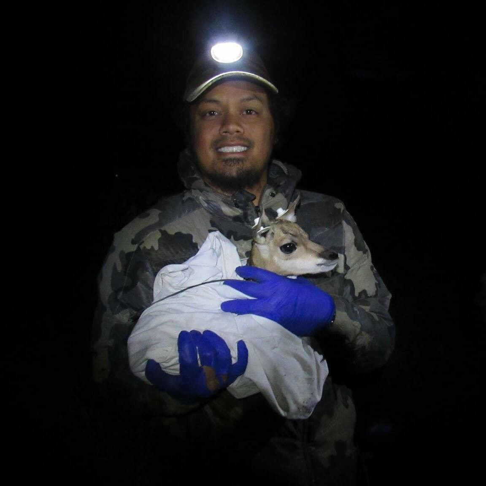

Hi, I'm Nan! I was born and raised in San Diego, California. I'm currently a Ph.D. student in the Department of [Fisheries & Wildlife](https://fw.msu.edu) and [Ecology, Evolution & Behavior](https://eeb.msu.edu) program at Michigan State University. Here is my [CV](/vitae/).

My scholarly interests include interdisciplinary research, wildlife ecology, conservation biology, socio-ecological systems, remote sensing and Bayesian and spatial statistics. I apply research tools from these relevant disciplines in order to examine pressing issues in conservation and sustainability in Southeast Asia. 

While this website focuses on discussing code for quantitative analysis, such as statistical modeling, remote sensing and/or spatial ecology, I also write about science, conservation, sustainability and life in academia as a graduate student at [Serious Conservation](https://seriousconservation.org).

When I'm not doing the science, I enjoy hunting, backpacking, and DJ'ing. Under the alias DJ Dead Serious, I've opened for musical acts such as Wiz Khalifa, Travis Scott and DJ Mustard and have spun at venues in San Diego, Las Vegas and Paris. Check out my irregularly updated [soundcloud](https://soundcloud.com/djdeadserious).

